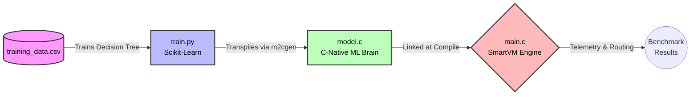

# SmartVM — Workload-Aware Scheduling in Embedded Runtimes via On-Device Decision Trees

> A proof-of-concept embedded bytecode virtual machine that trains a decision tree on its own runtime telemetry and transpiles the model to zero-dependency C code — enabling proactive, ML-augmented task scheduling with no external libraries, no cloud inference, and no OS abstraction layer.

---

## Table of Contents

- [Overview](#overview)
- [Key Results](#key-results)
- [Architecture](#architecture)
- [Project Structure](#project-structure)
- [How It Works](#how-it-works)
- [Getting Started](#getting-started)
  - [Prerequisites](#prerequisites)
  - [Build and Run](#build-and-run)
  - [Retraining the Model](#retraining-the-model)
- [The Three Schedulers](#the-three-schedulers)
- [The ML Pipeline](#the-ml-pipeline)
- [Design Decisions](#design-decisions)
- [Limitations and Future Work](#limitations-and-future-work)
- [Dependencies](#dependencies)
- [Author](#author)

---

## Overview

Standard scheduling algorithms — Round-Robin, MLFQ — are reactive. They respond to what a task has *already done*: a CPU-hogging task gets demoted, an I/O-yielding task gets promoted. By the time the scheduler adapts, cycles have already been wasted.

**SmartVM** takes a different approach. It instruments its own task execution to collect telemetry, trains a `DecisionTreeClassifier` offline on that data, and uses `m2cgen` to transpile the trained model into a plain C `score()` function — no Python runtime, no ML library, no heap allocation required at inference time. The result is a scheduler that classifies each task's workload type *proactively*, after its first execution quantum, and routes it accordingly before it has a chance to waste further CPU cycles.

The entire system is implemented in C and Python, compiles with GCC, and is designed to run on bare-metal embedded targets.

---

## Key Results

Benchmarked on a 70-task torture-test workload (20 CPU-Heavy + 50 I/O-Heavy tasks):

| Scheduler | Avg. Turnaround (CPU Cycles) | vs. Round-Robin | vs. MLFQ |
|---|---|---|---|
| Standard Round-Robin | 46,538 | — | +18.12% worse |
| Multi-Level Feedback Queue (MLFQ) | 39,396 | −15.35% | — |
| **ML-Augmented (SmartVM)** | **37,646** | **−19.11%** | **−4.44%** |

The ML-Augmented scheduler achieves the lowest average turnaround time by classifying tasks correctly from their **first quantum**, whereas MLFQ requires at least one full observation cycle per task before it adjusts priority.

---

## Architecture



---

## Project Structure

```
SmartVM/
│
├── Files/
│   ├── main.c              # SmartVM VM, TCB, all three schedulers, benchmark harness
│   ├── model.c             # Transpiled decision tree — generated by train.py, do not edit
│   ├── train.py            # Offline training script: CSV → DecisionTree → model.c
│   └── training_data.csv   # 1000-sample telemetry dataset exported from SmartVM
│
├── Figures/
│   ├── system_architecture.png
│   ├── decision_tree_visual.png
│   ├── benchmark_results.png
│   ├── training_data_distribution.png
│   └── scheduler_comparison_chart.png
│
└── ProjectReport/          # Full LaTeX project report (B.Tech dissertation)
```

---

## How It Works

### 1. Task Representation

Each task is a bytecode program stored as an `int` array. The VM supports four opcodes:

| Opcode | Behaviour |
|---|---|
| `LOAD_VAL` | Push an immediate value onto the stack — counts as a CPU op |
| `ADD` | Pop two values, push their sum — counts as a CPU op |
| `IO_WAIT` | Simulate an I/O stall — counts as an I/O op, yields the CPU immediately |
| `HALT` | Mark task complete, record turnaround time |

Each task runs inside a **Task Control Block (TCB)** that tracks `cpu_ops`, `io_wait_ops`, instruction pointer, stack, and turnaround time.

### 2. Telemetry Collection

SmartVM records the `CPU_Ops` and `IO_Wait` counts accumulated by each task at the end of its execution and writes them to `training_data.csv` with a ground-truth label (`0` = CPU-Heavy, `1` = I/O-Heavy). This dataset drives the offline training step.

### 3. Feature Normalisation

Raw op counts cannot be compared directly across tasks of different lengths. Before calling `score()`, the scheduler normalises both features onto a fixed 20-instruction basis:

```c
double projected_cpu = ((double)task->cpu_ops / total_ops) * 20.0;
double projected_io  = ((double)task->io_wait_ops / total_ops) * 20.0;
```

This makes the decision tree's learned thresholds invariant to task length.

### 4. Inference and Routing

After each quantum, the scheduler calls `score(features, output_scores)`. If `output_scores[1] > output_scores[0]` (I/O-Heavy predicted), the task is pushed to the **front** of the ready queue via `enqueue_front()`. Otherwise it joins the **rear** via `enqueue()`.

---

## Getting Started

### Prerequisites

**Runtime:**
- GCC (any version supporting C99)

**Model retraining (optional):**
- Python 3.8+
- `pip install scikit-learn m2cgen pandas`

### Build and Run

The repository includes a pre-transpiled `model.c`. You can compile and run immediately without retraining:

```bash
# Compile
gcc Files/main.c Files/model.c -o smartvm -lm

# Run benchmark
./smartvm
```

**Expected output:**

```
--- Generating Torture Test Workload ---

====================================================
              BENCHMARK RESULTS
====================================================
1. Standard Round Robin (Dumb Scheduler):
   Avg Turnaround Time:     46538 CPU cycles

2. Multi-Level Feedback Queue (Industry Standard):
   Avg Turnaround Time:     39396 CPU cycles

3. ML-Augmented (Smart Scheduler):
   Avg Turnaround Time:     37646 CPU cycles

=> AI vs DUMB:  Improved efficiency by 19.11%
=> AI vs MLFQ:  Improved efficiency by 4.44%
====================================================
```

### Retraining the Model

If you modify the workload or want to regenerate `model.c` from scratch:

```bash
# 1. Run SmartVM in telemetry-export mode to regenerate training_data.csv
#    (modify main.c to write CSV output, or use the existing dataset)

# 2. Train and transpile
cd Files/
python3 train.py

# 3. Recompile with the new model
gcc main.c model.c -o smartvm -lm
```

> **Note:** `train.py` uses `.values` (raw NumPy arrays) rather than named DataFrame columns when calling `clf.fit()`. This is required by `m2cgen`, which uses positional indexing (`input[0]`, `input[1]`) in the generated C code. Using named columns causes incorrect feature mapping.

---

## The Three Schedulers

All three schedulers are implemented in `main.c` and run on the same workload sequentially.

### Round-Robin (`run_scheduler(..., false)`)
Tasks are dequeued, executed for one quantum (`QUANTUM = 5` instructions), and re-enqueued at the rear unconditionally. No workload awareness.

### ML-Augmented (`run_scheduler(..., true)`)
Identical to Round-Robin, except after each quantum the scheduler calls `score()` with the task's normalised telemetry features. I/O-Heavy predictions result in `enqueue_front()`, CPU-Heavy predictions in `enqueue()`.

### MLFQ (`run_mlfq_scheduler()`)
Three priority queues (0 = high, 2 = low). Tasks start at priority 0. If a task issues an `IO_WAIT` during its quantum (detected by comparing `io_wait_ops` before and after), it stays at its current priority. If it exhausts its full quantum without yielding, it is demoted to the next lower queue.

---

## The ML Pipeline

| Step | Tool | Output |
|---|---|---|
| Telemetry export | SmartVM (C) | `training_data.csv` (1,000 samples) |
| Feature engineering | `train.py` | Normalised `CPU_Ops`, `IO_Wait` |
| Model training | `scikit-learn` `DecisionTreeClassifier(max_depth=3)` | Trained tree object |
| Transpilation | `m2cgen.export_to_c()` | `model.c` — 28 lines, ~200 bytes compiled |
| Inference | Compiled `score()` in SmartVM | Per-task classification at dispatch time |

The depth-3 constraint keeps the generated C code minimal. The root split (`IO_Wait ≤ 6.5`) alone classifies over 50% of training samples with zero Gini impurity. Deeper trees would add code size and branch-prediction overhead with negligible accuracy gain on this workload.

---

## Design Decisions

**Why a depth-3 tree?** Embedded Flash budgets are small. The transpiled `model.c` compiles to approximately 200 bytes of machine code — comfortably within the constraints of any Cortex-M class microcontroller. Deeper trees offer diminishing accuracy returns at increasing code cost.

**Why `m2cgen` over ONNX / TFLite?** Both ONNX Runtime and TensorFlow Lite require heap allocation and external header dependencies, which are incompatible with bare-metal C targets. `m2cgen` outputs a single function requiring only `string.h`, with no runtime allocations.

**Why simulate in CPU cycles rather than wall-clock time?** Wall-clock measurements on a hosted OS are confounded by kernel scheduling, cache effects, and timer resolution. Simulated ticks give deterministic, reproducible results that isolate the scheduling algorithm's behaviour.

**Why `enqueue_front()` for I/O-Heavy tasks?** I/O-Heavy tasks yield the CPU voluntarily after each `IO_WAIT`. Promoting them to the front minimises the time between successive I/O operations, reducing turnaround without starving CPU-Heavy tasks (which naturally consume their full quanta).

---

## Limitations and Future Work

- **Static model:** The decision tree is trained once offline and frozen. It does not adapt to workload drift at runtime. Online retraining or periodic model refresh would address this.
- **Synthetic workload:** `training_data.csv` and the benchmark tasks are synthetic. Tasks with mixed CPU/IO phases (e.g., a task that computes for 1,000 ops then issues 50 I/O waits) are not represented.
- **Simulation only:** All timing is in simulated CPU cycles within SmartVM, not real hardware cycles. Porting to a physical ARM Cortex-M4 or RISC-V target would provide real energy and latency measurements.
- **Binary classification:** The model outputs only CPU-Heavy or I/O-Heavy. A finer-grained classifier (e.g., mixed, memory-bound) would require extending the opcode set and retraining.
- **No starvation protection:** The current ML-Augmented scheduler has no aging mechanism. A long-running CPU-Heavy task will stay at the rear indefinitely if new I/O tasks keep arriving.

---

## Dependencies

| Component | Dependency | Version |
|---|---|---|
| VM runtime | GCC | Any C99-compatible |
| Model training | Python | 3.8+ |
| | scikit-learn | ≥ 1.0 |
| | m2cgen | ≥ 0.9 |
| | pandas | ≥ 1.3 |
| Report | LaTeX (pdflatex) | TeX Live 2023+ |

---
