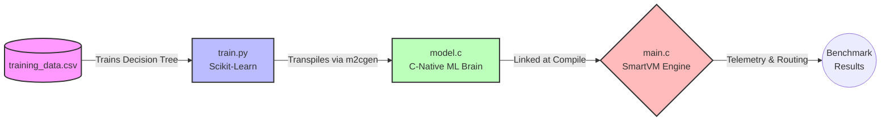

```mermaid
flowchart LR
    A[(training_data.csv)] -->|Trains Decision Tree| B["train.py<br>Scikit-Learn"]
    B -->|Transpiles via m2cgen| C["model.c<br>C-Native ML Brain"]
    C -->|Linked at Compile| D{"main.c<br>SmartVM Engine"}
    D -->|Telemetry & Routing| E(("Benchmark<br>Results"))
    
    style A fill:#f9f,stroke:#333,stroke-width:2px
    style B fill:#bbf,stroke:#333,stroke-width:2px
    style C fill:#bfb,stroke:#333,stroke-width:2px
    style D fill:#fbb,stroke:#333,stroke-width:2px
```
